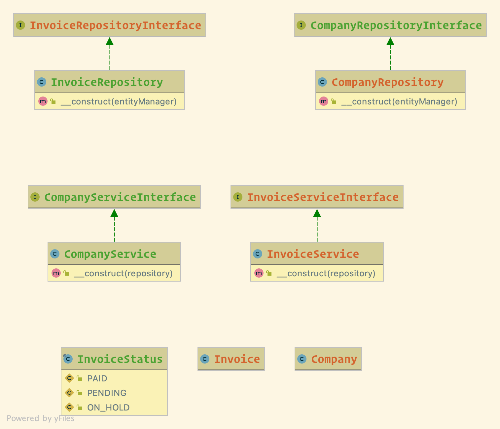

### Class diagram


## End point to search in Rides
- A REST API application to add Invoices and Companies

- Create Company
- POST `http://localhost:8001/api/companies`
- Body
```json
{
	"name": "ALDI AND REWE INC",
	"risk_limit": 1000
}
```
- Response
```josn
{
  "data": {
    "id": 71,
    "riskLimit": 1000,
    "name": "POWER Speed inc",
    "createdAt": "2021-07-18T16:01:40+00:00",
    "updatedAt": "2021-07-18T16:01:40+00:00"
  }
}
```

- Create Invoice
- POST `http://localhost:8001/api/invoices`
- Body
```json
{
	"description": "Seld Speed inc",
	"cost": 1000,
	"quantity": 5,
	"company": 2
}
```
- Response
```json
{
  "data": {
    "id": 66,
    "quantity": 5,
    "description": "Seld Speed inc",
    "status": 1,
    "cost": 1000,
    "company": {
      "id": 62,
      "riskLimit": 6340,
      "name": "Runte, White and Mosciski",
      "createdAt": "2021-07-18T08:37:47+00:00",
      "updatedAt": "2021-07-18T08:37:47+00:00"
    },
    "createdAt": "2021-07-18T15:04:17+00:00"
  }
}
```

- Mark Invoice as Paid
- PATCH `http://localhost:8001/api/invoices/8`
- Body
```json
{
	"status": 1
}
```
- Response
```josn
{
  "data": {
    "id": 74,
    "quantity": 5,
    "description": "Seld Speed inc",
    "status": 1,
    "cost": 123123123,
    "company": {
      "id": 61,
      "riskLimit": 10111,
      "name": "Witting and Sons",
      "createdAt": "2021-07-18T08:37:47+00:00",
      "updatedAt": "2021-07-18T08:37:47+00:00",
    },
    "createdAt": "2021-07-18T18:45:22+00:00"
  }
}
```

### Installation
- Run `make build`

### Running the tests
- Run `make test`

### TODO
- Notify the companies that have pending invoices almost close to the risk limitation and offer increasing/upgrade the risk limit level (for sure with extra fees or extra commissions).
- Scoring system for each company invoices so we can adapt the risk limit based on what is most appropriate for their debts.
- logging system for each invoice (status/invoice life cycle) starting from placing the invoice until collecting it.
- Dedicate table/document for invoices_status_reasons) so we can provide more visibility for the account managers for their companies.
- Providing Swagger API documentation.
- Use JWT for protecting the APIs and exposing rules and permissions for both APIs. 
- Adding more business validation on updating invoice API.

### Built With

* [PHP7.4](http://php.net)
* [Docker](https://www.docker.com/)
* [Symfony5](http://www.symfony.com)
    * Serializer
    * Symfony/phpunit-bridge
    * DataFixture/Seeding
    * Doctrine
